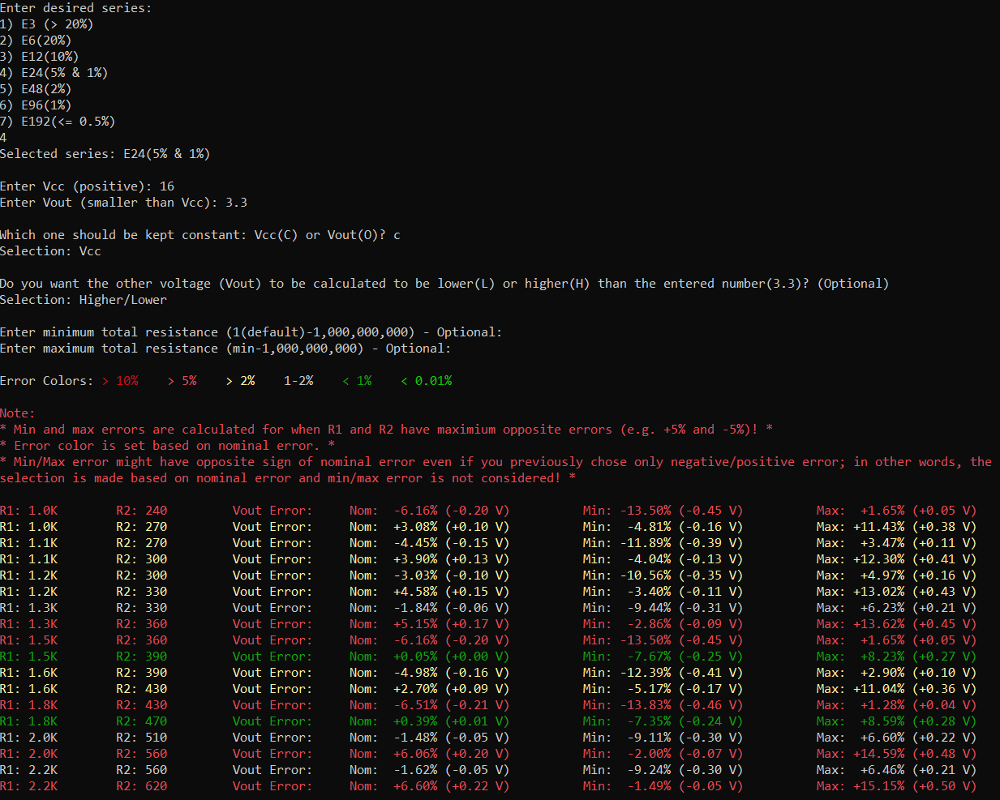

# Resistor Selector
A simple, single source file program to calculate two standard resistor values for a voltage divider, written completely in C++14.

**Right now, this program is only compatible with Windows!**

#### Features include:
 - Finding resistor values in the desired [E series](https://en.wikipedia.org/wiki/E_series_of_preferred_numbers)
 - Calculating the error for VCC or VOut
 - Option to only find values that result in positive/negative voltage error
 - Option to specify min/max total resistance (R1 + R2)
 
##Usage

